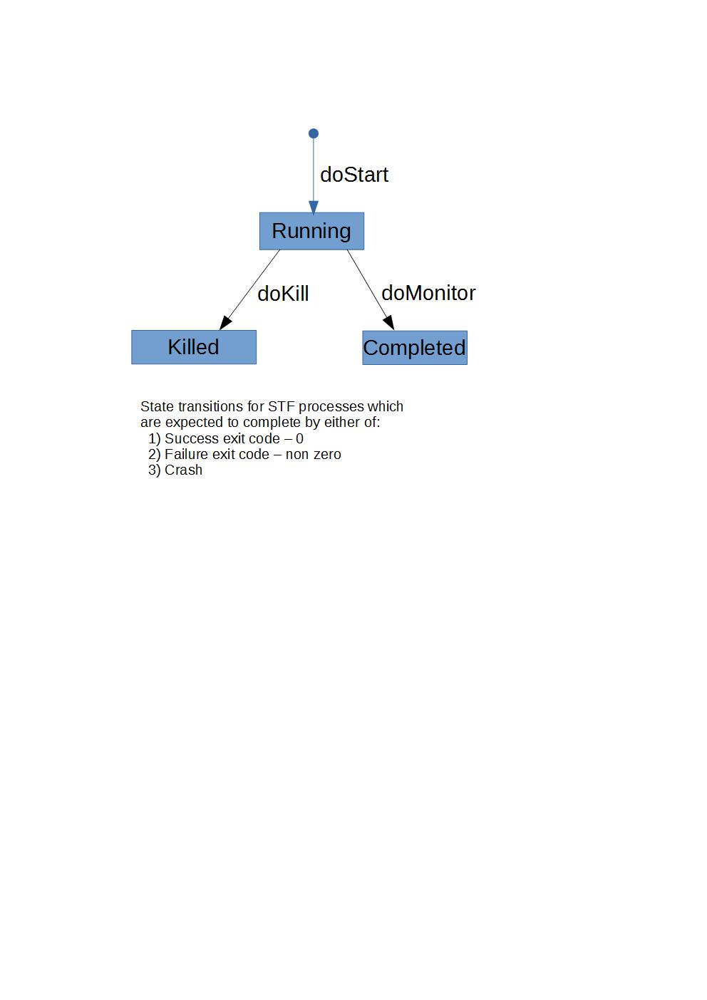
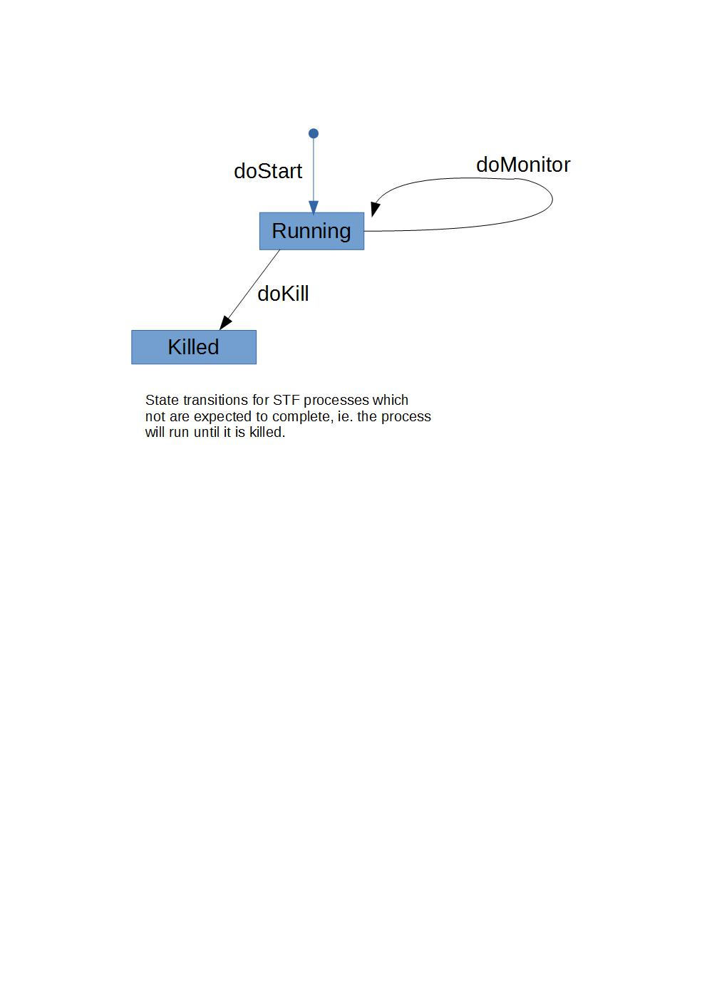

# STF - System Test Framework

<a href="#1">Introduction</a>  
<a href="#2">STF Principles</a>  
<a href="#3">Development</a>  
&nbsp;&nbsp;<a href="#3.1">An example STF test</a>  
&nbsp;&nbsp;<a href="#3.2">Interfaces and test methods</a>  
&nbsp;&nbsp;&nbsp;&nbsp;<a href="#3.2.1">help method</a>  
&nbsp;&nbsp;&nbsp;&nbsp;<a href="#3.2.2">pluginInit method</a>  
&nbsp;&nbsp;&nbsp;&nbsp;<a href="#3.2.3">setUp method</a>  
&nbsp;&nbsp;&nbsp;&nbsp;<a href="#3.2.4">execute method</a>  
&nbsp;&nbsp;&nbsp;&nbsp;<a href="#3.2.5">tearDown method</a>  
&nbsp;&nbsp;&nbsp;&nbsp;<a href="#3.2.6">STF Structure</a>  
&nbsp;&nbsp;<a href="#3.3">STF actions</a>  
&nbsp;&nbsp;<a href="#3.4">File system access</a>  
&nbsp;&nbsp;<a href="#3.5">New test development</a>  
&nbsp;&nbsp;<a href="#3.6">Porting existing tests</a>  
<a href="#4">Process Execution</a>  
&nbsp;&nbsp;<a href="#4.1">Overview</a>  
&nbsp;&nbsp;<a href="#4.2">Single threaded execution</a>  
&nbsp;&nbsp;<a href="#4.3">Concurrent execution</a>  
&nbsp;&nbsp;&nbsp;&nbsp;<a href="#4.3.1">Starting processes</a>  
&nbsp;&nbsp;&nbsp;&nbsp;<a href="#4.3.2">Monitoring processes</a>  
&nbsp;&nbsp;&nbsp;&nbsp;<a href="#4.3.3">Killing processes</a>  
&nbsp;&nbsp;&nbsp;&nbsp;<a href="#4.4">STF process state checking</a>  
&nbsp;&nbsp;<a href="#4.5">STF process output</a>  
<a href="#5">Test Actions</a>  
&nbsp;&nbsp;<a href="#5.1">File system actions</a>  
&nbsp;&nbsp;&nbsp;&nbsp;<a href="#5.1.1">doRm - remove a file</a>  
&nbsp;&nbsp;&nbsp;&nbsp;<a href="#5.1.2">doRm - remove a directory</a>  
&nbsp;&nbsp;&nbsp;&nbsp;<a href="#5.1.3">doCp - copy a file</a>  
&nbsp;&nbsp;&nbsp;&nbsp;<a href="#5.1.4">doCpDir - copy a directory</a>  
&nbsp;&nbsp;&nbsp;&nbsp;<a href="#5.1.5">doMkdir - create a directory</a>  
&nbsp;&nbsp;&nbsp;&nbsp;<a href="#5.1.6">doCd - change current directory</a>  
&nbsp;&nbsp;&nbsp;&nbsp;<a href="#5.1.7">doUnzip - unpack an archive</a>  
&nbsp;&nbsp;&nbsp;&nbsp;<a href="#5.1.8">doWriteFile - create a file</a>  
&nbsp;&nbsp;&nbsp;&nbsp;<a href="#5.1.9">doFileEdit - update an existing file</a>  
&nbsp;&nbsp;&nbsp;&nbsp;<a href="#5.1.10">doJarUpdate - update a jar file</a>  
&nbsp;&nbsp;&nbsp;&nbsp;<a href="#5.1.11">doValidateFileExists - confirm file exists</a>  
&nbsp;&nbsp;<a href="#5.2">Process management</a>  
&nbsp;&nbsp;<a href="#5.3">Test results</a>  
&nbsp;&nbsp;&nbsp;&nbsp;<a href="#5.3.1">doReportFilteredTestResults - filter test results</a>  
&nbsp;&nbsp;<a href="#5.4">Miscellaneous</a>  
&nbsp;&nbsp;&nbsp;&nbsp;<a href="#5.4.1">doVerifyDisplayAvailable - confirm display connected</a>  
&nbsp;&nbsp;<a href="#5.5">Process creation</a>  
&nbsp;&nbsp;&nbsp;&nbsp;<a &nbsp;&nbsp;&nbsp;&nbsp;href="#5.5.1">createJavaProcessDefinition</a>  
&nbsp;&nbsp;&nbsp;&nbsp;<a href="#5.5.2">createJUnitProcessDefinition</a>  
&nbsp;&nbsp;&nbsp;&nbsp;<a href="#5.5.3">createJDKToolProcessDefinition</a>  
<a href="#6">Test Development</a>  
<a href="#7">Advanced and Unusual cases</a>  
&nbsp;&nbsp;<a href="#7.1">Classpath management for non-Eclipse projects</a>  
&nbsp;&nbsp;&nbsp;&nbsp;<a href="#7.1.1">stfclasspath.xml file</a>  
&nbsp;&nbsp;&nbsp;&nbsp;<a href="#7.1.2">Eclipse project management</a>  
&nbsp;&nbsp;<a href="#7.2">Context based output file names</a>  
<a href="#8">Execution & debugging</a>  

<a name="1"></a>
## Introduction
STF (System Test Framework) is a testing tool which provides a framework for automating tests which cannot, or cannot easily, be automated using unit test frameworks such as junit or testNG.

Whereas a JUnit or TestNG test runs in a single process the tests run by STF frequently involve running multiple processes, or require setup which must be done before the test process can run.

An STF test is implemented as a high level description of the required actions, such as:
- Creating directories
- Unzipping files
- Running processes, sequentially or concurrently
- Waiting for process completion
- Filtering test results such as text output for success or for known failures

The examples used in this document assume that you have a working STF installation, as described in 'STF-GettingStarted.md'.

<a name="2"></a>
## STF Principles

STF was designed to enable the automation of multiple step, multi-process test cases in a way which
1. Provides a clear demarcation between setting up the test environment and executing the tests which use the environment.
1. Enforces automation code reuse.
1. Allows a developer investigating test failures to modify the test execution in order to isolate commands within the multistep process in order to amend those commands to employ debugging aids or to run private builds of the system under test.

The test developer describes his / her test in terms of the high level steps to be carried out.  This test description is implemented as a Java class which uses the STF class library to carry out the steps.  Examples of library methods are 'doUnzip' or 'doRunForegroundProcess'.

Test execution is in two stages.
Firstly, the test java classes are executed. The result of that execution is:
1. A unique directory into which the artifacts and results of the test execution are placed.
2. A setup.pl, execute.pl and teardown.pl perl script.
3. The creation of test data or other test resource artifacts required for the test execution.

Secondly, (and optionally), the setup.pl, execute.pl and teardown.pl scripts are executed in that order.

Generating the test script code in this way has the following advantages:
1. Only capabilities which have been provided by the framework can be used, since the framework is responsible for emitting the perl code which executes the test.  This prevents the test script code containing errors which would lead to erroneous test results.
2. The script code is tailored specifically to the environment in which the test is to be executed.  Since at code generration time the execution environment is known, the generated code does not need to contain placeholders for variables such as the location of the system under test, nor  conditionals to execute different code on one platform versus another.  This leads to more compact, easily understood and modifiable code.
3. The generated code can be consistently and clearly documented, so that a developer can easily identify points of failure in the test execution and modify the code to assist in debugging.

<a name="3"></a>
## Development

<a name="3.1"></a>
### An example STF test

To be completed.

<a name="3.2"></a>
### Interfaces and test methods

For a class to be treated as runnable test automation by STF it must conform to certain conditions:
- It must implement the StfPluginRootInterface
- It must implement the five key plugin methods - help, pluginInit, setUp, execute and tearDown

The easiest way to conform to these conditions is for a test automation class to implement StfPluginInterface:
``` java
public interface StfPluginInterface extends StfPluginRootInterface {

    public void help(HelpTextGenerator help) throws StfException;

    public void pluginInit(StfCoreExtension test) throws StfException;

    public void setUp(StfCoreExtension test) throws StfException;

    public void execute(StfCoreExtension test) throws StfException;

    public void tearDown(StfCoreExtension test) throws StfException;
}
```

<a name="3.2.1"></a>
#### help method
This method is run if the user runs the test automation with a '-help' argument.
Once the standard STF help text has been generated the automations help() method is called.

The help method has two responsibilites. Firstly, it should provide a short summary about
the purpose of the test. It's purpose is to remind the reader about the test and maybe
refer them to full documentation which is held elsewhere.
The second purpose of the help is to supply a summary about any test specific arguments.

For example:
``` java
public void help(HelpTextGenerator help) throws StfException {
  help.outputSection("MathLoadTest test");
  help.outputText("MathLoadTest runs workloads of Math related tests, "
      + "by default it runs all math tests if no workload is specified.");

  help.outputSection("MathLoadTest test options");
  help.outputArgName("workload", "NAME");
  help.outputArgDesc("This is the name of the workload to run, it supports "
      + "the following workloads: math, bigdecimal, autosimd");
}
```

<a name="3.2.2"></a>
#### pluginInit method

To be completed.

<a name="3.2.3"></a>
#### setUp method

To be completed.

<a name="3.2.4"></a>
#### execute method
The execute method is the key part of the automation. It lists the actions that need to
be performed to actually run the test. The steps in the execute method are only executed
if setUp ran without any errors.

To help with test development/debugging the actions in the execute stage should be
able to be run repeatedly.

As with the setUp stage, the failure of any action results in the termination of the stage.

<a name="3.2.5"></a>
#### tearDown method

To be completed.

<a name="3.2.6"></a>
#### STF Structure
The following diagram shows the keys components for STF based test automation.

It shows the test automation code at the top of the diagram and its interaction with
STF through the extension classes and the environment class.

The left hand side of the diagram shows that both the developer and STF both have access
to the file system and property file.
Towards the bottom of the diagram, in the 'perl code' box, STF provides insight into the
test run by revealing the generated perl code, whose execution is going to implement the
steps described in the automation code.


<a name="3.3"></a>
### STF actions

To be completed.

<a name="3.4"></a>
### File system access

To be completed.

<a name="3.5"></a>
### New test development

To be completed.

<a name="3.6"></a>
### Porting existing tests

To be completed.

<a name="4"></a>
## Process Execution

<a name="4.1"></a>
### Overview
STF provides 4 key methods for controlling process execution:
- doRunForegroundProcess() - run a process synchronously.
- doRunBackgroundProcess() - start running one or more processes in the background.
- doMonitorProcess() - wait for process completion.
- doKillProcess() - kill a running process.

doRunForegroundProcess() provides a pretty conventional method to synchronously run a process.
STF starts the process and then waits until it finishes.
This method operates independently from the remaining three methods as it is completely
self contained.

The remaining three methods: doRunBackgroundProcess, doMonitorProcess and doKillProcess, usually operate
together to control concurrent execution. Typically multiple processes
are started with several doStart calls, which is followed by a doMonitor call
until completion, with a doKill sometimes being used to kill processes
which would otherwise never complete.<br>

STF tracks the state of created processes and will abort the test before
execution starts if it detects an invalid or illogical sequence of calls, for
example attempting to kill a process which has already completed. For more
details on this see the section titled 'STF process state checking'.

If any of the process control methods fail (and exit with a non zero value)
then STF will kill all processes which could be running at that point.

See the following sample programs for examples on using these methods:
- SampleRunProcess.java - synchronously runs a Java process
- SampleConcurrentProcesses.java - Concurrently runs several processes
- SampleClientServer.java - runs with a server that never completes
- SampleClientServer2.java - variation of SampleClientServer.java. Runs a process which is expected to complete with non-zero exit value

<a name="4.2"></a>
### Single threaded execution

Most STF based tests run processes using the single-threaded model, running the
steps one process at a time, and not starting a process until the previous one has
completed.

This is the mode in which the basic actions, such as doMkdir, doUnzip,
doFileEdit, etc, operate. They run sequentially in the same order as
specified in the test automation code.

The following example synchronously runs a java process which is expected to complete with an exit value of 3:
``` java
test.doRunForegroundProcess("Run client", "CL", ECHO_ON, ExpectedOutcome.exitValue(3).within("10s"),
    test.createJavaProcessDefinition()
        .addJvmOption("-Xmx100M")
        .addProjectToClasspath("sampleProject2")
        .runClass(MiniClient.class)
        .addArg("3"));
```

In this case the Java process runs in the foreground until one of the following occours:
- The process completes with the expected exit code. The happy case.
- The process completes with an unexpected exit code. Test failure.
- Java produces a core/dump file. Test failure.
- The process exceeds its allowed run time. The process is then killed. Test failure.

The arguments passed to doRunForegroundProcess are:
- Comment - a short summary stating why the process is being run.
- Mnemonic - an abbreviation to identify the process in the STF output. Also used as a prefix when process output is echoed.
- Echo setting - to turn on/off echoing of process output to STF output.
- ExpectedOutcome - describes what the test expects to happy when the process is executed. See below for examples.
- A process definition - describes how to run the process. Again, see below.

Process which are expected to complete must specify their maximum run
time. This is encoded as a string value, using 'h', 'm' and 's' characters
to specify how long the process can run before it is killed and the test
is marked as a failure. Here are some examples showing the 4 different
types of expected outcome:
``` java
ExpectedOutcome.cleanRun().within("10s")  // we expect exit code 0
ExpectedOutcome.exitValue(3).within("1m30s")
ExpectedOutcome.crashes().within("3h15m")
ExpectedOutcome.neverCompletes()
```

The Java process definition is built up by using a series of calls to a
fluent style interface. When STF executes the test it converts the
JavaProcessDefinition into a String which executes the process. The
constructed value is visible in the setup.pl or execute.pl script.
The java process definition object allows the caller to specify:
- JVM options, such as '-Xmx50M' or '-Xverbosegclog:...'
- Classpath construction, using workspace projects, jar files or directories.
- The java class to be run.
- Arguments to the java process.
- Data from another process as an argument (see addPerlProcessData)

Output from all running processes is written to 2 files in the results directory: &lt;mnemonic&gt;.stdout and &lt;mnemonic&gt;.stderr.<br>
<br>

<a name="4.3"></a>
### Concurrent execution

<a name="4.3.1"></a>
#### Starting processes

Any number of processes can be started by calling doRunBackgroundProcess. This method takes the same arguments as doRunForegroundProcess, so to avoid repetition on the arguments please see the previous section on 'Single threaded execution'.

The key difference between doRunBackgoundProcess and doRunForegroundProcess is that foreground method waits for the process to complete before moving on to the next step. The background method initiates the process in the background but does not wait for it complete. Any number of processes can be
started.

The second key difference is that doRunBackgroundProcess returns an object to represent the running process. This object internally tracks the state of the process and allows the test to monitor the running process or kill it when it is no longer required.

If you need to start several processes with the same invocation
configuration and arguments then this can be done by using the
doRunBackgroundProcesses method. This is basically the same as doRunBackgroundProcess except that it has an extra argument, which is the number of processes that should be started. This returns an array of StfProcess objects can be used to monitor or kill the processes as a batch. Having access to the StfProcess object does allow different handling of each child process, but as they have all be started with the same arguments, it's normal practice to treat them as a block of processes, with all of them being
monitored or killed at the same time. A unique per-process mnemonic is created by appending the instance number onto the process mnemonic, so if 3 client processes which use the 'CL' mnemonic are started, then the full mnemonic names would be CL1, CL2 and CL3.

This code starts four 'client' processes which all run MiniClient with the same arguments and expectations:
``` java
StfProcess[] clients = test.doRunBackgroundProcesses("Run client", "CL", 4, ECHO_OFF, ExpectedOutcome.cleanRun().within("10s"),
    test.createJavaProcessDefinition()
        .addProjectToClasspath("sampleProject2")
        .runClass(MiniClient.class));
```

<a name="4.3.2"></a>
#### Monitoring processes

Once one or more processes have been started you'll need to wait for their completion. This is done by calling the doMonitor method, which waits until it either detects a failure or all processes complete successfully. The following example of its usage has been copied from SampleClientServer2.java:
``` java
StfProcess[] clients = test.doRunBackgroundProcesses("Run client", "CL", 4, ECHO_ON, ExpectedOutcome.cleanRun().within("10s"),
    test.createJavaProcessDefinition()
        .addProjectToClasspath("sampleProject2")
        .runClass(MiniClient.class));

// Wait for clients to complete.
test.doMonitorProcesses("Wait for clients to complete", server, clients, failingClient);
```

The most important task of monitoring is to synchronise the test, so we can wait for the completion of child processes before moving to the next part of the the test, but it also performs several other functions:

- Fails the step if any of the monitored processes do not complete as expected.
- Echos output from processes started with ECHO_ON to the STF output.
- Checks each processes runtime against its limit. Fails as soon as one of the processes exceeds its limit.

Monitoring can check processes which are expected to complete as well as those which are not expected to complete, for example in SampleClientSever we start a server process which runs an endless loop and a client which is going to complete after several seconds. Calling doMonitor(server,client) in necessary in such situations as we must wait for the client process, but it's also good to be able to fail the test if the server crashes. The doMonitor command will run until it either detects a failure or the successful completion of all the processes which are expected to complete. The implication
of this logic is the server process (or any other which is not expected to complete) will still be running at the end of the doMonitor. This can be surprising at first but is needed to provide both a monitoring capability for endless processes and the ability to have tests which don't run forever.

``` java
while (true) {
    echo output from processes with echo=on to STF output

    for (all processes being monitored) {
        check for core files

        if (process completed but not as expected) {
            error.
            return -1
        }

        if (process exceeded maximum runtime) {
            error
            return -1
        }
    }

    if (all process expected to complete have already completed) {
        return 0;
    }
}
```

doMonitor doesn't really care if processes exit cleanly with a zero value, or crash, or run forever; it cares about whether or not its observable behaviour matches the expectation of the test. If the test expects a process to, say, crash then monitoring will only be
regarded as passing when that process does crash. If the process is expected to crash but doesn't then that is a test failure.

As with all of the do methods, any detected failure in monitoring will cause it exit with a non zero value, which will lead to all outstanding processes being killed and the failure of the test.

<a name="4.3.3"></a>
#### Killing processes

Running processes can be terminated by running doKill. This is typically used towards the end of a test to stop those processes which would otherwise run forever.

This can kill any number of processes, but the following example shows the killing of just a single process:
``` java
test.doKillProcesses("Stop server process", server);
```

<a name="4.4"></a>
### STF process state checking
STF tracks the potential state of each process so that it can catch logic errors in the test code. The errors which be detected by this static analysis are:
- Leaving an orphan process. i.e. a process which has been started but has neither been monitored nor killed.
- Attempting to monitor a terminal process which has already been monitored (and must therefore either have failed or have completed).
- Killing a process which has already completed or has been killed.
- Attempting to run doMonitor for processes when all of the processes are not going to complete (as the test would the run forever).

The following diagram shows the state transitions for a process which is expected to complete. Any actions apart from those labelled will result in a runtime failure:


The following diagram shows the state transitions for a process which is not expected to complete. This shows that it can be monitored any number of times but must be killed to prevent the test leaving behind an orphaned process. Again, any attempt to deviate from the transitions shown results in a runtime error.


The STF logic which checks for illogical and incorrect sequences of calls runs before the actual test execution. If you get such an error you will notice that none of the tests processes have been run and there is no output for the usual setup, execute and teardown stages.

<a name="4.5"></a>
### STF process output
Process output is always written to two files in the results directory:
<mnemonic>.stdout and <mnemonic>.stderr.

STF echos the output of processes started with ECHO_ON during the following calls:
- doMonitorProcesses()
- doKillProcesses()

No output from processes started with ECHO_OFF is echoed by STF. Regardless of the echo setting, all output from child processes can be found in their stdout and stderr files in the results directory.

The implementation of process echoing means that there a few details
to be aware of when debugging. Firstly, output from multiple processes may appear out of sequence. This is because output from each process is echoed in turn. For example, if we are monitoring processes X and Y, and process Y produces output and then process X produces output, then exactly which output is echoed first will depend on which process is the next one to be checked. If process X is checked first then its new output will be echoed, even though process Y has some older output.

The second point to bear in mind is that processes may not produce their output immediately, as it depends on how frequently they flush their log file output. This obviously adds an unpredictable time lag to the echo.

And finally, it should be remembered that output is only echoed during the monitor and kill commands. If a time consuming action is run after starting some processes then their output will build up and not be visible until the entering a doMonitor/doKill.

<a name="5"></a>
## Test Actions

<a name="5.1"></a>
### File system actions
<a name="5.1.1"></a>
- **doRm** - remove a file
<a name="5.1.2"></a>
- **doRm** - remove a directory
<a name="5.1.3"></a>
- **doCp** - copy a file
<a name="5.1.4"></a>
- **doCpDir** - copy a directory
<a name="5.1.5"></a>
- **doMkdir** - create a directory
<a name="5.1.6"></a>
- **doCd** - change current directory
<a name="5.1.7"></a>
- **doUnzip** - unpack an archive
<a name="5.1.8"></a>
- **doWriteFile** - create a file
<a name="5.1.9"></a>
- **doFileEdit** - update an existing file
<a name="5.1.10"></a>
- **doJarUpdate** - update a jar file
<a name="5.1.11"></a>
- **doValidateFileExists** - confirm file exists

<a name="5.2"></a>
### Process management actions

The synchronous or asynchronous running of multiple processes is covered in the Process Management section.

The core methods to support process execution are:
- **doRunForegroundProcess** - synchronously run single process
- **doRunForegroundProcesses** - synchronously run multiple processes
- **doRunBackgroundProcess** - synchronously run single process
- **doRunBackgroundProcesses** - synchronously run multiple processes
- **doMonitorProcesses** - wait for process completion
- **doKillProcesses** - kill a process


<a name="5.3"></a>
### Test results actions

<a name="5.3.1"></a>
- **doReportFilteredTestResults** - filter test results

<a name="5.4"></a>
### Miscellaneous actions

<a name="5.4.1"></a>
- **doVerifyDisplayAvailable** - confirm display connected

<a name="5.5"></a>
### Process creation

This section covers the methods used to define how to run a process. They are not strictly speaking action methods, but they are described here as they really have the same importance. Were it not for the split between defining a process and running it, they
could equally well have been implemented as 'do' methods.

Once the test code has a process definition then it can be used to synchronously or asynchronously start one or more instances of the process.

The Process Management section has some examples of running single and multiple concurrent processes.

<a name="5.5.1"></a>
#### createJavaProcessDefinition

This method provides a fluent style interface to allow the capture of the information needed to start a Java process.

The following example shows the use of the key methods to define a platform independent description of the information needed to run a Java process:

``` java
JavaProcessDefinition clientJavaInvocation = stfCore.createJavaProcessDefinition()
    .addJarToClasspath(equinoxLauncherJar)
    .addProjectToClasspath("test.jlm")
    .addJvmOption("-Djavax.net.ssl.keyStoreType=JKS")
    .addJvmOption("-Djavax.net.ssl.keyStorePassword=change1t")
    .addJvmOption("-Dcom.sun.management.jmxremote.ssl.need.client.auth=true")
    .runClass(MemoryProfiler.class)
    .addArg("proxy")
    .addArg(statsFile)
    .addArg("localhost");
```  

Other useful JavaProcessDefinition methods:
- addPerlProcessData(StfProcess,Integer)
-- his method is useful for taking data relating to one StfProcess, and passing that data to another Java process as an argument.
-- e.g. addPerlProcessData(<StfProcess>,StfConstants.PERL_PROCESS_PID) will add 	the process ID from <StfProcess> to your Java command as an argument. See StfConstants.PERL_PROCESS_DATA for a full list of available process data.

<a name="5.5.2"></a>
#### createJUnitProcessDefinition

This method creates a JavaProcessDefinition object which is prepopulated to allow the running of JUnit tests.

This example synchronously runs a JUnit test:
``` java
// Build a description of how to run JUnit
JavaProcessDefinition junitProcessDefinition = test.createJUnitProcessDefinition("stf", null,
    TestArgumentProcessing.class,
    TestResultsProcessor.class);

// Synchronously run the JUnit tests
test.doRunForegroundProcess("Run JUnit tests", "J", ECHO_ON,
    ExpectedOutcome.cleanRun().within("1m"),
    junitProcessDefinition);
```

createJUnitProcessDefinition() actually sets things up to run a STF utility class called JUnitRunner instead of the standard JUnit runner. STF has its own class to run JUnit tests because the default JUnit runners always completes with a zero exit value.
STF is driven by process exit codes, so this obviously makes it impossible for STF to know if the JUnit tests have passed or failed. Hence the need for a class which can run the JUnit test but also complete with a non-zero return value when a test fails.

The responsibilities of the JUnitRunner class are:
- *exit value*. Returns 0 if all tests pass, otherwise 1. As already mentioned, this is the primary reason for the existence of JUnitRunner.java
- *test exclusions*. JUnitRunner supports the supply of an exclusions file, which lists all of the tests which are allowed to fail. This is useful if a test needs to run third party code which is known to fail.
- *live output*. It reports the start & end of each test. This makes
it much easier to see what is happening, identify which method is producing which output, etc.

STF is not doing any analysis on the JUnit output. It's not at all uncommon for tests to deliberately create exceptions, so it's really not possible to parse this is in a generic way. Besides, testing frameworks like JUnit are driven by assertions in the test code, so it's fundamentally wrong for another piece of software to parse their output and try to make another judgement about whether or not a test has passed or failed.

<a name="5.5.3"></a>
#### createJDKToolProcessDefinition

This variant creates a JavaProcessDefinition needed to run a JDK tool or utility in the jdk bin directory. For example, keytool, jar, etc.

The following example creates a keystore and generates a key pair.

``` java
StfProcess keytool = test.doRunBackgroundProcess("Run keytool", "KEY", ECHO_ON, ExpectedOutcome.cleanRun().within("10s"),
test.doRunForegroundProcess("Run keytool", "KEY", ECHO_ON, ExpectedOutcome.cleanRun().within("10s"),
    test.createJDKToolProcessDefinition()
        .setJDKToolOrUtility("keytool")
        .addArg("-genkeypair")
        .addArg("-dname")
        .addArg("\"cn=John Example, ou=Java, o=IBM, c=UK\"")
        .addArg("-alias")
        .addArg("business")
        .addArg("-keypass")
        .addArg("secret-password")
        .addArg("-keystore")
        .addArg(test.env().getTmpDir().childFile("mykeystore").getSpec())
        .addArg("-storepass")
        .addArg("new-keystore-pw")
        .addArg("-validity")
        .addArg("180"))
```

<a name="6"></a>
## Test Development

- Non synchronous processes
- Test specific arguments
- Expected test failures
- Custom extensions

- Running from local build

<a name="7"></a>
## Advanced and Unusual cases

<a name="7.1"></a>
### Classpath management for non-Eclipse projects

When running automation code from the Eclipse workspace STF uses the contents of the projects .classpath file to determine the projects dependencies. STF is also able to use .classpath file when running an automation plugin from output of the build process.

There are some occasions in which the automation code is not being compiled by Eclipse, and there is therefore no need to have a valid .classpath file. The most typical case would be when a project needs to use a newer Java version than that supported by Eclipse.

<a name="7.1.1"></a>
#### stfclasspath.xml file

The solution to this problem is for the project to have a top level 'stfclasspath.xml' file instead of the usual '.classpath' file. This 'stfclasspath.xml' file is in the
same format as a standard '.classpath' file, and references the projects dependent projects and/or jar files. STF will use this file when there is no '.classpath' file.

This situation effectively means that a workspace contains 2 different types of projects. Firstly, most projects are hopefully a standard java project which has a
'.classpath' file, or secondly, a 'general' project which is not compiled by Eclipse, and contains a 'stfclasspath.xml' file. STF throws an exception if a project has both '.classpath' and 'stfclasspath.xml' files.

Projects using Java 9 modularity may be building to a bin directory which contains 2 different classpath hierarchies. Files such as '.../bin/net/adoptopenjdk/x.class' are built in the traditional way with, in this case, a package of net.adoptopenjdk containing class 'x'. In java 9 the bin directory may also contain modular output, with say '.../bin/common-mods/com.hello/net/adoptopenjdk/y.class' being a compiled class for 'y.java' from the package in 'net.adoptopenjdk' in the 'com.hello' module. Note the extra level of directory called 'common-mods', which is used to structure
the compiled modules but is neither part of the module or class hierarchy.

When such a structure is created through Ant scripts then the structure has to be described to STF. Multiple bin directories can be specified in stfclasspath.xml with
the 'j9output' kind. For example the following stfclasspath.xml could be created by copying a valid .classpath file and adding some j9output entries:

``` xml
&lt;?xml version="1.0" encoding="UTF-8"?&gt;
&lt;classpath&gt;
	&lt;classpathentry kind="src" path="src/openjdk.test.modularity"/&gt;
	&lt;classpathentry kind="con" path="org.eclipse.jdt.launching.JRE_CONTAINER"/&gt;
	&lt;classpathentry exported="true" kind="lib" path="/systemtest_prereqs/junit-4.12/junit-4.12.jar"/&gt;
	&lt;classpathentry combineaccessrules="false" kind="src" path="/stf.core"/&gt;
	&lt;classpathentry kind="output" path="bin"/&gt;
	&lt;classpathentry kind="j9output" path="bin/common-mods/displayService"/&gt;
	&lt;classpathentry kind="j9output" path="bin/common-mods/com.helper"/&gt;
	&lt;classpathentry kind="j9output" path="bin/tests"/&gt;
&lt;/classpath&gt;
```

So the suggested route for projects which require a newer version JVM level than the current level supported by Eclipse is:
- Project starts as a 'general' project. This would be compiled through the build process with build.xml files, and use a 'stfclasspath.xml' file to allow the STF execution of automation plugins from the build output.
- At some point in the future, when Eclipse has caught up, the project   can be converted to a Java project and the .classpath and .project files can be deleted. STF execution is then from either the Eclipse workspace or the build output.

This route has the advantage that the Eclipse workspace as always clean, allowing compile errors in other to be noticed, and also allowing STF execution of other projects directly from the Eclipse workspace.

Projects will need to determine their own migration strategies for more complex situations. For example, perhaps some new tests should really be added to pre-existing project X but because of Eclipse JVM versioning problems would be added to general project Y, before eventually being moved to into their final location
in project X.

<a name="7.2"></a>
### Context based output file names

Some tests will want to run a process which produces output files whose names need to be based on some runtime property of the execution. For example, a test may create the profile to run a Java process which is used multiple times in the test. If the executed process needs to create an output file, then the name of the file cannot be fixed, otherwise the second execution will overwrite the output of the first execution.

<p>The dynamic creation of values for cases such as creating output file names is handled by using three magic value strings:
- StfConstants.PLACEHOLDER_STF_COMMAND_NUMBER - This is replaced with the step number. Eg 1, 2, 3, etc
- StfConstants.PLACEHOLDER_STF_COMMAND_MNEMONIC - The placeholder is replaced with the mnemonic of the command. Eg, SCL or XYZ, etc.
- StfConstants.PLACEHOLDER_STF_PROCESS_INSTANCE - When running multiple concurrent processes this value is replaced with the instance number (1,2,3,etc). If used in a single instance process the placeholder is replaced with an empty string.

